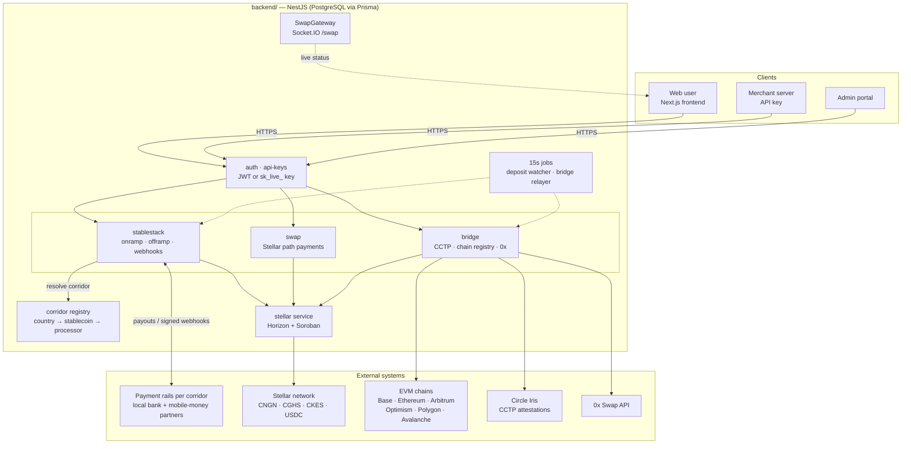
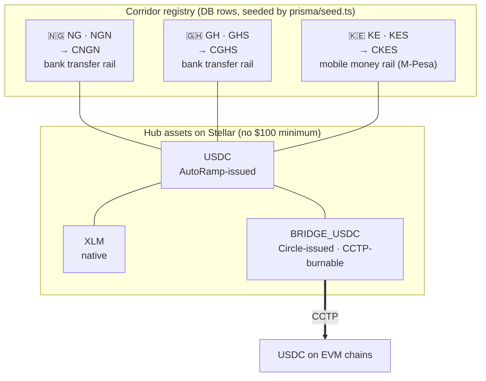

# AutoRamp

**AutoRamp is a cross-border payments app for Africa.** People can move money between their local currency and stablecoins (digital dollars and digital local currencies), and between stablecoins on different blockchains. They never need to understand the crypto underneath: they pay by bank transfer or M-Pesa and get a stablecoin, or send a stablecoin and get money in their bank or M-Pesa account.

**Stellar is the home chain.** AutoRamp issues a stablecoin for each local currency on Stellar, and connects to other blockchains through Circle's CCTP.

---

## What it does

| | |
|---|---|
| **Buy** | Pay in local currency (bank transfer, or M-Pesa in Kenya) and receive a stablecoin in your wallet, on Stellar or on another chain. |
| **Sell** | Send a stablecoin, from Stellar or another chain, and receive local currency in your bank account or M-Pesa wallet. |
| **Swap** | Trade one stablecoin for another on the same chain, for example CKES ↔ USDC ↔ CNGN on Stellar. |
| **Bridge** | Move USDC between Stellar and Base, Ethereum, Arbitrum, Optimism, Polygon or Avalanche, and optionally convert it on arrival. |
| **Merchant API** | Businesses get API keys to build Buy and Sell into their own products. |
| **Admin portal** | The AutoRamp team manages users, merchants, API keys, transactions and supported countries. |

## Supported countries (corridors)

A **corridor** is one country's local currency, the Stellar stablecoin that represents it, and the banking partner that moves the real money. Corridors are database rows, so adding a country doesn't need a code change.

| Country | Currency | Stablecoin | Buy (pay in) | Sell (paid out to) |
|---|---|---|---|---|
| 🇳🇬 Nigeria | NGN (naira) | **CNGN** | Bank transfer | Bank account |
| 🇬🇭 Ghana | GHS (cedi) | **CGHS** | Bank transfer | Bank account |
| 🇰🇪 Kenya | KES (shilling) | **CKES** | **M-Pesa** prompt on your phone | **M-Pesa** wallet |

AutoRamp partners with a different local payment rail in each country: bank-transfer rails in Nigeria and Ghana, and a mobile-money rail (M-Pesa) in Kenya. All of them plug into one common interface, so adding a new rail doesn't change the rest of the app. Nigeria operates through a licensed partner. Ghana and Kenya aren't licensed yet, and Kenya's mobile-money flow hasn't been tested live yet. See [`backend/README.md`](backend/README.md#supported-corridors) for details.

---

## How it fits together



### Corridors and the Stellar asset hub

Every local stablecoin trades through a small set of **hub assets** (USDC and XLM), so any pair can be swapped in one step on Stellar. Only Circle's own USDC (`BRIDGE_USDC`) can cross to other chains.



**More diagrams:** the step-by-step Buy, Sell, CCTP bridge and cross-chain payout flows are in [`backend/README.md` → Architecture](backend/README.md#architecture). The internal reference, [`docs.md`](docs.md), covers custody, signing keys, the data model and known gaps.

### Who holds the money

- **Swaps and bridge transfers you start** are signed in **your own wallet**. AutoRamp only prepares the transactions.
- **Buy deliveries and cross-chain payouts** are sent from **AutoRamp's own Stellar account**. Before any payout from AutoRamp's funds, the backend checks what was actually paid or burned on-chain, not what the user claimed.

---

## Repository layout

```
autoramp-stellar-app/
├── backend/            NestJS API: onramp/offramp, corridors, swaps, CCTP bridge + relayer,
│                       merchant API, admin, auth. PostgreSQL via Prisma.
├── frontend/           Next.js web app for the Stellar corridors: Buy / Sell / Swap /
│                       Cross-chain (incl. M-Pesa), history, merchant dashboard, admin portal.
├── autoramp-frontend/  Next.js web app maintained on main: EVM swaps (0x), bridging,
│                       OTC desk, merchant and admin dashboards.
├── stellar-cctp/       Standalone TypeScript package for Circle CCTP on Stellar (Soroban):
│                       burn, attestation polling, forwarder hook data, receive.
├── docs/               Public merchant API reference (Mintlify site + OpenAPI spec).
├── docs.md             Internal architecture reference: flows, custody, data model, known gaps.
└── CONTRIBUTING.md     Development workflow, branching, commit and PR conventions.
```

| Folder | Start here |
|---|---|
| [`backend/`](backend) | [`backend/README.md`](backend/README.md): features, corridors, architecture diagrams, setup, env settings, tests |
| [`frontend/`](frontend) | [`frontend/README.md`](frontend/README.md): pages, wallets, env variables, running locally |
| [`autoramp-frontend/`](autoramp-frontend) | [`autoramp-frontend/README.md`](autoramp-frontend/README.md) |
| [`stellar-cctp/`](stellar-cctp) | [`CONTRIBUTING.md` → Working with the stellar-cctp package](CONTRIBUTING.md#working-with-the-stellar-cctp-package); exports in [`stellar-cctp/src/index.ts`](stellar-cctp/src/index.ts) |
| [`docs/`](docs) | [`docs/introduction.mdx`](docs/introduction.mdx), [`docs/quickstart.mdx`](docs/quickstart.mdx) and [`docs/openapi.json`](docs/openapi.json) for merchants integrating the API |

> **Two frontends, for now.** `frontend/` is the UI built for this backend's Stellar corridors. `autoramp-frontend/` is the team's app from `main`. Both are kept intact after merging `main` into this branch, so nothing is lost. Merging them into one app is a separate follow-up.

## Tech stack

| Part | Built with |
|---|---|
| Backend | NestJS, Prisma, PostgreSQL, Socket.IO, `@stellar/stellar-sdk`, viem |
| Frontend | Next.js 16, React 19, Tailwind CSS 4, Zustand, TanStack Query, Stellar Wallets Kit |
| Blockchains | Stellar (Horizon + Soroban), plus EVM chains via Circle CCTP |
| Payment rails | Local bank-transfer and mobile-money partners per country, behind one pluggable interface |
| Other services | Circle Iris (bridge attestations), 0x (EVM swaps), Resend (email), MonieRate (FX rates) |

---

## Quick start

**1. Backend** (see [`backend/README.md`](backend/README.md) for every setting):

```bash
cd backend
npm install
cp .env.example .env          # fill in database, Stellar and partner keys
npx prisma migrate deploy
npm run seed                  # creates the NG / GH / KE corridors
npm run start:dev             # Swagger docs at /api
```

**2. Frontend** (see [`frontend/README.md`](frontend/README.md)):

```bash
cd frontend
npm install
cp .env.example .env.local    # NEXT_PUBLIC_API_URL must point at the backend
npm run dev                   # http://localhost:3000
```

For a working Stellar testnet environment, run `npm run setup:testnet` in `backend/` once. It creates and funds the accounts and writes the keys to `.env`.

**Before going live**, set `NODE_ENV=production` and the webhook secret for each payment rail you use (listed in `backend/.env.example`), and make sure `OTP_DEV_RETURN_CODE` is **not** set. [`backend/README.md`](backend/README.md#security-relevant-settings) explains each one.

## Tests

```bash
cd backend
npm run test       # unit tests
npm run test:e2e   # end-to-end: real API against an in-memory Postgres
```

The frontend has no automated test suite yet.
