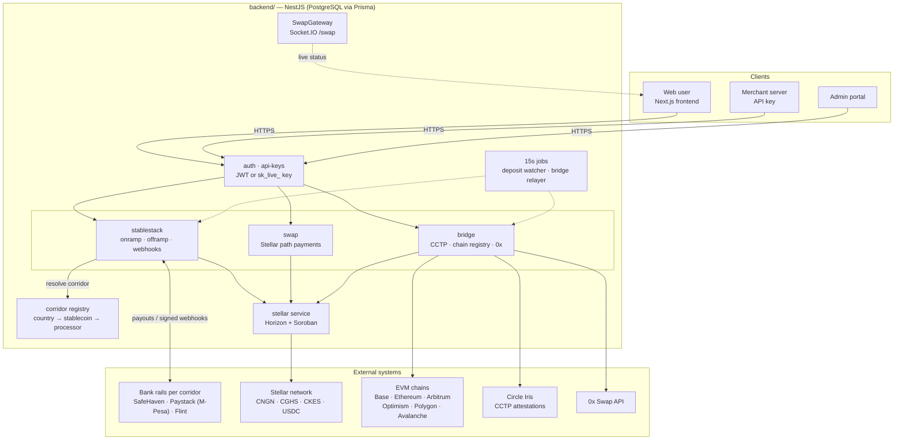
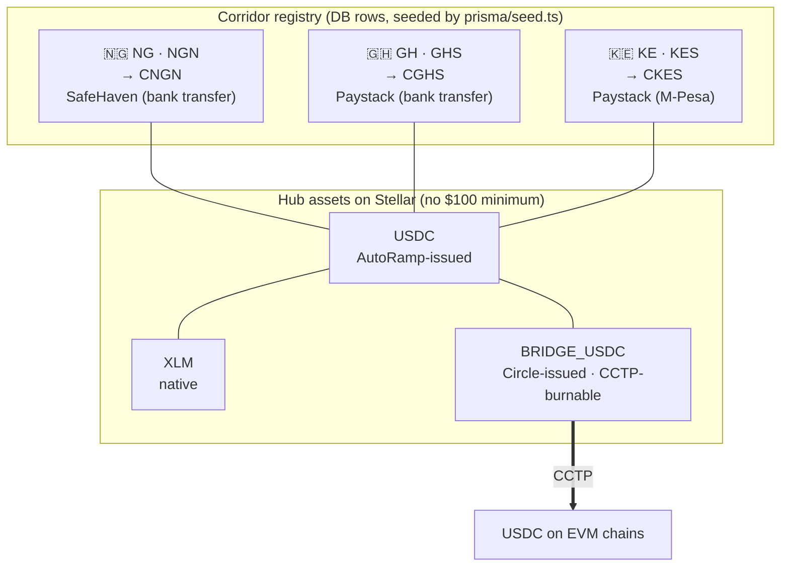
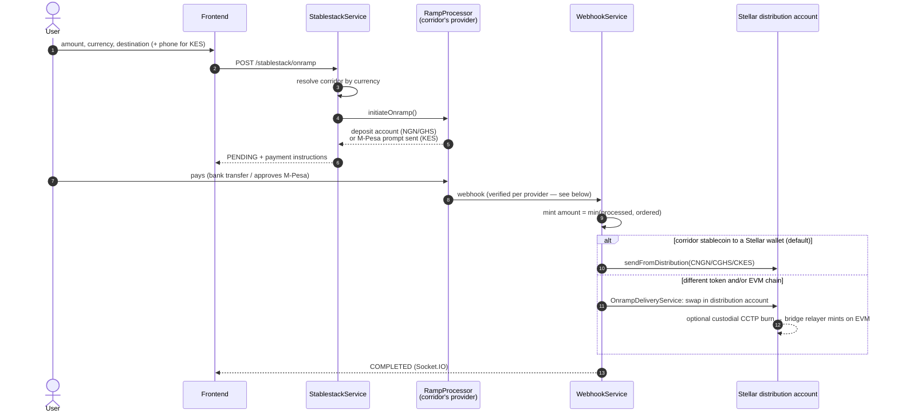
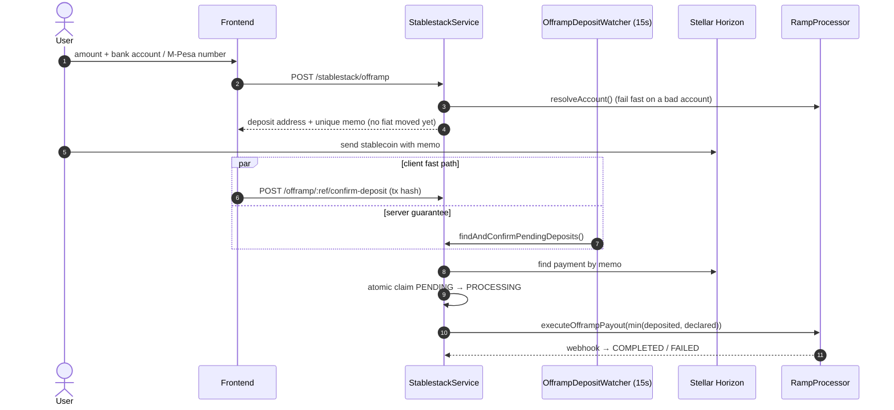
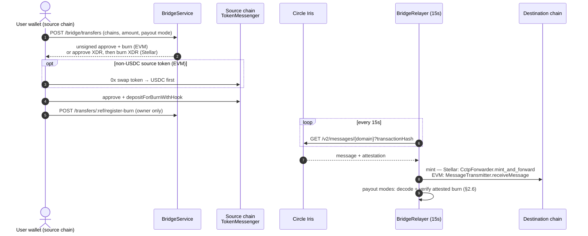
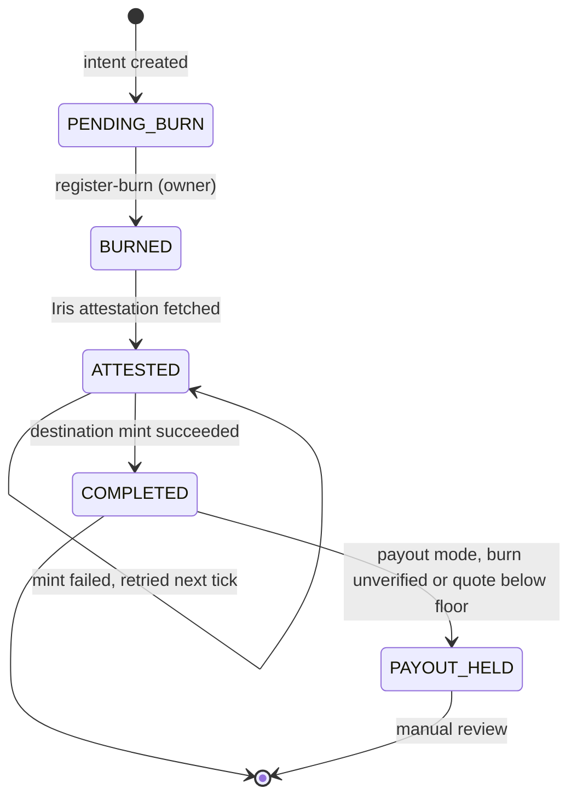
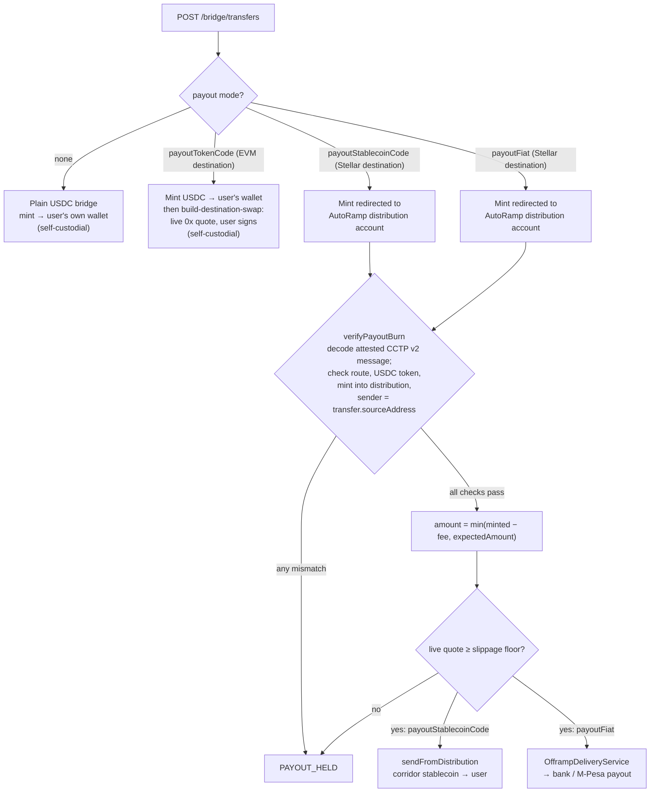

# AutoRamp

AutoRamp is a cross-border payments app that moves money between **local bank currency** and **stablecoins**, and between **stablecoins on different blockchains**, without the user needing to understand the crypto plumbing underneath. It currently supports **Nigeria (NGN), Ghana (GHS) and Kenya (KES)**; see [Supported corridors](#supported-corridors).

## What AutoRamp can do

### For everyday users
- **Buy (onramp):** pay in local currency by bank transfer (or M-Pesa mobile money in Kenya) and receive a stablecoin in your wallet. For example, pay ₦10,000 and receive 10,000 CNGN. Delivery can go to a Stellar wallet or, via a bridge, to a wallet on an EVM chain such as Base.
- **Sell (offramp):** send a stablecoin and receive local currency in your bank account, or in your M-Pesa wallet in Kenya. The stablecoin can come from Stellar or from any supported chain.
- **Swap:** trade one stablecoin for another on the same chain. On Stellar this uses path payments; on EVM chains it uses the 0x Swap API. Your own wallet signs every swap.
- **Bridge:** move USDC between blockchains using Circle's CCTP, for example Base → Stellar, and optionally convert it into a different stablecoin on arrival.
- **Track transactions:** see onramp, offramp and swap history with live status updates.
- **Sign in without a password:** email plus a one-time code.

### For businesses (merchant API)
- **API keys** (`sk_live_...`) for server-to-server access, issued once an admin approves the account.
- **Onramp and offramp endpoints:** start onramps and offramps, list supported banks, verify a bank account name and fetch transaction history.
- **Public API reference** in [`../docs`](../docs), a Mintlify site with an OpenAPI spec.

### For the AutoRamp team (admin portal)
- **Users and merchants:** manage user accounts and approve merchant API access.
- **API keys:** issue, revoke and review API keys along with their usage.
- **Transactions:** oversee transactions platform-wide, with analytics for volume, success rate and trends over time.
- **Corridors:** add or change a country, its currency, its stablecoin and its banking partner. No code change is needed.

### Supported corridors
Each country is a **corridor**: a local currency, the Stellar stablecoin that represents it, and the banking partner that moves the real money. Corridors are rows in the database (`npm run seed` creates the three below), so adding a country doesn't need a code change.

| Country | Currency | Stablecoin | Buy (pay in) | Sell (paid out to) | Partner | Licensing |
|---|---|---|---|---|---|---|
| 🇳🇬 Nigeria | NGN (naira) | **CNGN** | Bank transfer to a virtual account | Bank account | SafeHaven (default) | Partnered |
| 🇬🇭 Ghana | GHS (cedi) | **CGHS** | Bank transfer to a virtual account | Bank account (GhIPSS) | Paystack | Unlicensed |
| 🇰🇪 Kenya | KES (shilling) | **CKES** | **M-Pesa**: a payment prompt pops up on the user's phone | **M-Pesa** mobile wallet | Paystack | Unlicensed |

All three stablecoins trade against each other and against USDC and XLM on Stellar. That means a user can, for example, buy CKES with shillings and swap it to USDC or CNGN.

**Kenya (KES) notes:**
- **Buying** uses Paystack's Charge API to send an M-Pesa prompt to the user's phone, because Paystack's virtual bank accounts only support NGN and GHS. The user must enter a phone number in +254 format.
- **Selling** pays out to an M-Pesa number via Paystack Transfers. Payouts to Kenyan bank accounts are not supported yet.
- **Not yet tested live:** the KES flow is built from Paystack's documentation but hasn't been run against Paystack's live sandbox. Confirm the M-Pesa charge response and KES amount units with a real test key before launch.
- **No license yet:** AutoRamp has no license or licensed partner in Kenya, so treat the corridor as ready to demo, not ready for production.

### Supported rails
| Layer | What's used |
|---|---|
| Home chain | **Stellar**, where AutoRamp issues local-currency stablecoins (CNGN, CGHS, CKES) |
| Other chains | Base, Ethereum, Arbitrum, Optimism, Polygon and Avalanche, via Circle CCTP |
| Bank rails | **SafeHaven** (recommended), **Paystack** and **Flint**, chosen per country corridor |
| Other services | Circle Iris (bridge attestations), 0x (EVM swaps), Resend (email), MonieRate (FX rates) |

For the architecture diagrams, see [Architecture](#architecture) below. The full internal reference, covering the custody model, data model and known gaps, is in [`../docs.md`](../docs.md).

---

## Architecture

These diagrams are also in [`../docs.md` §2](../docs.md#2-architecture-maps), along with the reasoning behind each flow and the custody and signing-key table.

### System map


### Corridors and the Stellar asset hub
Every corridor stablecoin trades through the hub assets, so any pair can be swapped with a single Stellar path payment. `USDC` (AutoRamp-issued) and `BRIDGE_USDC` (Circle-issued) are **different assets**; only `BRIDGE_USDC` can be burned through CCTP.



### Buy (onramp): fiat → stablecoin


### Sell (offramp): stablecoin → fiat


### Cross-chain bridge (Circle CCTP)


Bridge transfer states:



### Cross-chain payout modes
Payout modes spend AutoRamp's own funds, so the attested burn is decoded and checked before any payout. A mismatch holds the transfer for manual review.



---

## Tech stack

- **Backend (this folder):** NestJS, Prisma and PostgreSQL. It uses JWT and API-key auth, a Socket.IO gateway for live transaction status, and scheduled jobs for deposit watching and bridge relaying.
- **Frontend** ([`../frontend`](../frontend)): Next.js (App Router), Tailwind, Zustand, TanStack Query and Stellar Wallets Kit.

## Project setup

```bash
npm install
cp .env.example .env        # then fill in the values
npx prisma migrate deploy   # apply database migrations
npm run seed                # seed the corridor registry (needs CNGN_ISSUER_PUBLIC_KEY)
```

`.env.example` documents every variable. `src/config/env.validation.ts` is the authoritative list, and the app refuses to start if a required one is missing.

### Security-relevant settings
- **`FLINT_WEBHOOK_SECRET`:** without it, Flint webhooks are rejected. Register the callback URL as `.../stablestack/webhook?key=<secret>`.
- **`SAFEHAVEN_WEBHOOK_SHARED_SECRET`:** append it as `?key=` to the SafeHaven webhook URL.
- **`OTP_DEV_RETURN_CODE=true`:** for local development only. When email delivery fails, the sign-in code is returned in the API response. It's ignored when `NODE_ENV=production`, so leave it unset anywhere real users can sign in.
- **`NODE_ENV=production`:** set it explicitly in production. It defaults to `development`.

## Run the app

```bash
npm run start:dev    # watch mode
npm run start:prod   # production (after npm run build)
```

When running the frontend locally, set `PORT` to match its `NEXT_PUBLIC_API_URL` (the frontend's `.env.example` uses 3003; with no value set it falls back to 3001). Swagger docs are served at `/api`.

### Stellar testnet helpers
```bash
npm run setup:testnet       # one-time: create + fund testnet accounts, issue CNGN/USDC, seed a liquidity pool, write keys to .env
npm run smoke-test:testnet  # end-to-end smoke test against testnet
```

## Run tests

```bash
npm run test       # unit tests (*.spec.ts, next to the code)
npm run test:e2e   # integration tests: real Nest app + in-memory Postgres (PGlite)
npm run test:cov   # coverage
```

The e2e suites mock only external I/O (Stellar network calls and HTTP to providers), so routing, guards, validation and database logic are all exercised for real.

## Add an admin

Use the interactive script, which prompts for an email and password:

```bash
npx ts-node -r tsconfig-paths/register scripts/create-admin.ts
```

Or insert a row directly, with a bcrypt-hashed password:

```sql
INSERT INTO admins (id, email, password, "is_active", "created_at", "updated_at")
VALUES (
  gen_random_uuid(),
  'admin@example.com',
  '$2b$10$YourHashedPasswordHere', -- Use bcrypt to hash your password
  true,
  NOW(),
  NOW()
);
```
