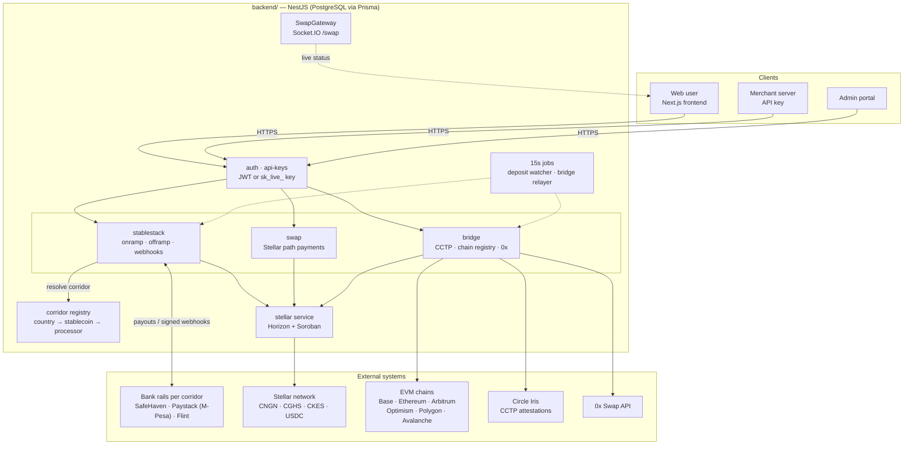
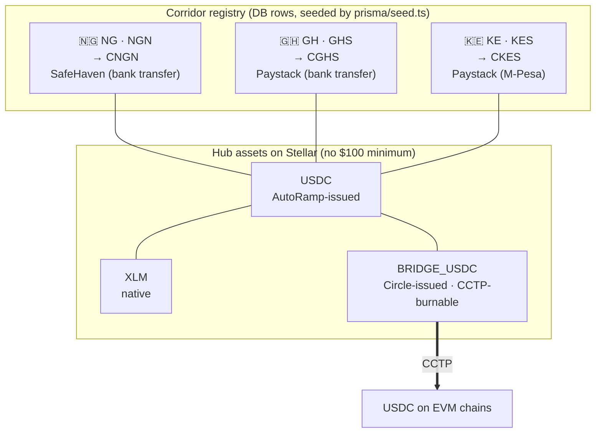
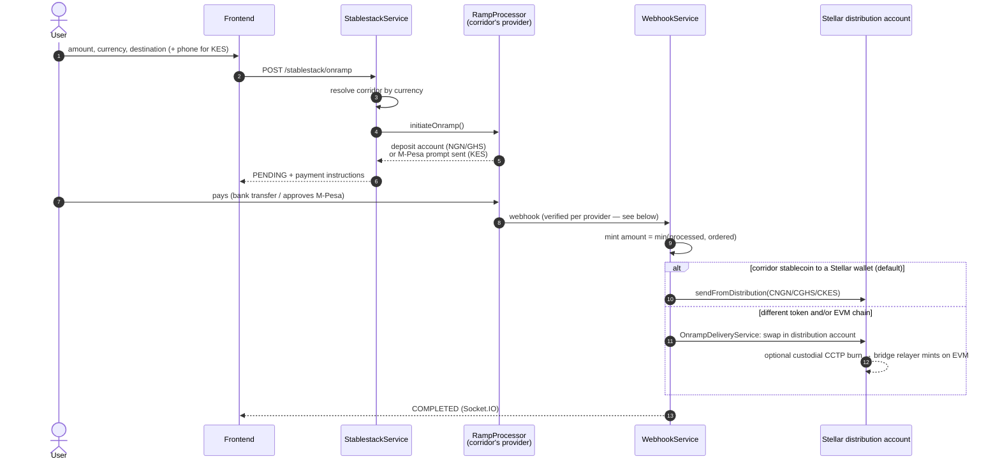
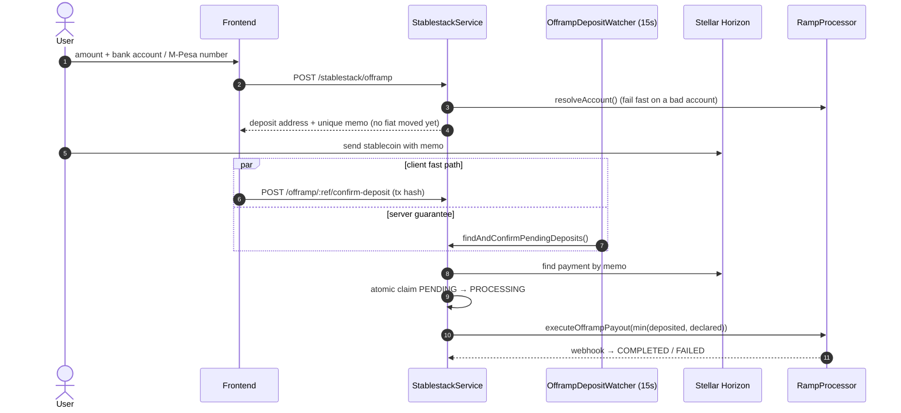
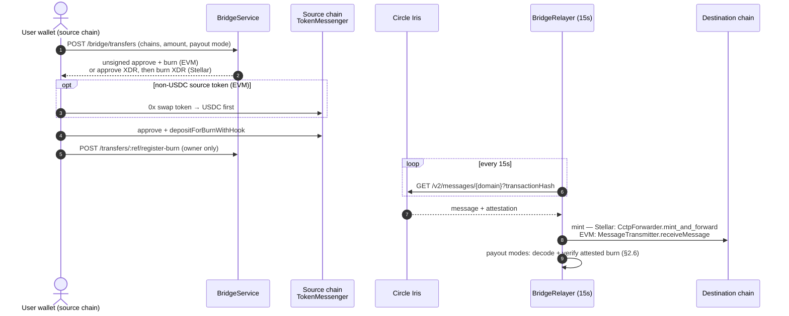
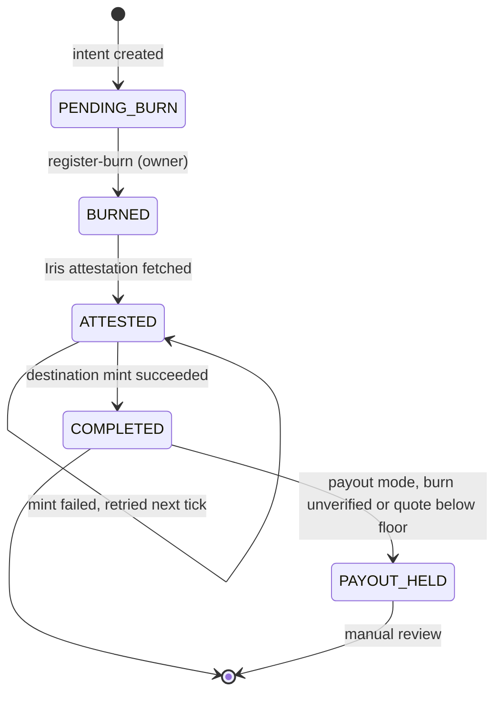
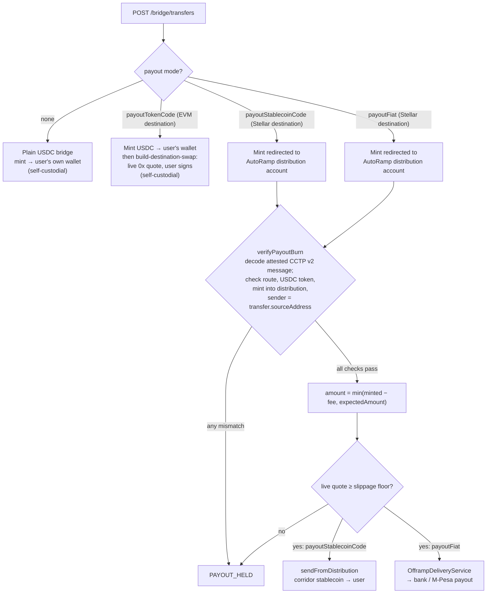

# AutoRamp — End-to-End Documentation

This document is a full architectural and functional reference for the AutoRamp codebase: what the app does, how the pieces fit together, and where the rough edges are. It covers both `backend/` (NestJS API) and `frontend/` (Next.js UI).

> Scope note: `docs/` at the repo root (Mintlify site: `introduction.mdx`, `quickstart.mdx`, `authentication.mdx`, `openapi.json`, `api-reference/`) is the **public-facing merchant API reference**, aimed at third-party integrators. This file is the **internal** reference — what the whole system does and how it's built.

---

## 1. What AutoRamp is

AutoRamp is a cross-border payments app that lets someone move value between **fiat currency** and **stablecoins**, and between **stablecoins on different blockchains**, without needing to understand the crypto plumbing underneath. Concretely, it offers four things from one interface:

- **Buy** — pay fiat (bank transfer or mobile money), receive a stablecoin.
- **Sell** — send a stablecoin, receive a fiat payout to a bank account.
- **Swap** — trade one stablecoin for another on the same chain (no bridging).
- **Bridge** — move USDC (or any registered stablecoin) from one blockchain to another, including converting it into a *different* stablecoin on the destination chain.

Stellar is the "home" chain — it's where AutoRamp's own corridor stablecoins are issued and where fiat rails are anchored — but the bridge infrastructure is chain-agnostic: any registered chain can be a source or destination.

---

## 2. Architecture maps

The diagrams below are Mermaid and render on GitHub. Each links back to the code that implements it.

### 2.1 System map

### 2.2 Corridors and the Stellar asset hub

A **corridor** (`Corridor` table, [`corridor/`](backend/src/modules/corridor)) binds a country to its currency, its Stellar stablecoin and its bank-rail processor. All corridor stablecoins trade through the **hub assets**, so any pair can be swapped with a Stellar path payment.

> `USDC` (AutoRamp's own issuer) and `BRIDGE_USDC` (Circle's issuer) are **different Stellar assets**. Only `BRIDGE_USDC` can be burned through CCTP; see §3.2.

### 2.3 Buy (onramp): fiat → stablecoin

**How each provider's webhook is trusted:**
- **Paystack:** HMAC-SHA512 signature over the raw request body.
- **SafeHaven:** a `?key=` shared secret, then the status is re-checked through SafeHaven's authenticated API.
- **Flint:** a required `FLINT_WEBHOOK_SECRET`. The webhook is rejected if the secret isn't set, and ignored for transactions on non-Flint corridors.

### 2.4 Sell (offramp): stablecoin → fiat

Selling from **another chain** skips the memo step. It reuses the bridge with `payoutFiat` (§2.6), and the payout fires once the attested burn has been verified.

### 2.5 CCTP bridge lifecycle

**Where the mint lands:**
- **Stellar destination:** the mint goes through Circle's **CctpForwarder** contract. `mintRecipient` and `destinationCaller` are both set to the forwarder, and `hookData` carries the real Stellar recipient.
- **EVM destination:** the mint goes straight to the user's address, with an open `destinationCaller` so anyone can complete it.

### 2.6 Cross-chain payout modes

### 2.7 Custody and signing keys

| Flow | Who signs | Key |
|---|---|---|
| Same-chain swap (Stellar or EVM) | User's wallet | — |
| Bridge source burn (Stellar or EVM) | User's wallet | — |
| Onramp delivery, stablecoin payouts, onramp-to-EVM burn | Backend (custodial) | `STELLAR_DISTRIBUTION_SECRET` |
| Stellar CCTP mint completion | Backend relayer | `STELLAR_BRIDGE_RELAYER_SECRET` (kept apart from distribution) |
| EVM CCTP mint completion | Backend relayer | `{CHAIN}_RELAYER_PRIVATE_KEY` |
| Fiat payouts | Bank-rail provider | provider API credentials |

- **Backend**: NestJS, PostgreSQL via Prisma, JWT + API-key auth, a Socket.IO gateway for live transaction status, and two `@Interval`-based background pollers (no message queue).
- **Frontend**: Next.js App Router, Tailwind, Zustand for client state (no React Context for wallets — plain stores), TanStack Query for server state, axios for HTTP.
- **Money movement is corridor- and chain-registry-driven**, not hardcoded: adding a new country/currency pair or a new blockchain is a database row (`Corridor`, `Chain`, `ChainToken`), not a code change, in the steady-state cases.

---

## 3. Core domain concepts

### 3.1 Corridor

A `Corridor` (`backend/src/modules/corridor/`) is the unit of "can AutoRamp actually serve this fiat currency, and how": country code, fiat currency, which Stellar-issued stablecoin represents that fiat (`CNGN` for NGN, `CGHS` for GHS, `CKES` for KES — the three seeded corridors; see the §2.2 map), which bank-rail provider handles it (`flint` / `paystack` / `safehaven`), and a licensing status. Onramp/offramp/swap all resolve "which stablecoin, which processor" through this table via `CorridorService`, rather than a single hardcoded NGN/CNGN path.

### 3.2 Hub assets

Three assets trade freely against every corridor stablecoin with no $100 minimum: **USDC** (AutoRamp's own self-issued Stellar asset, `USDC_ISSUER_PUBLIC_KEY`), **XLM** (native lumens), and **BRIDGE_USDC** (Circle's real, CCTP-bridgeable USDC — a *different* issuer than the app's own "USDC"). Everything else (a corridor's stablecoin, e.g. `CNGN`) has a $100 minimum swap amount and always trades relative to a fiat currency.

> **Critical distinction, easy to get wrong**: `getUsdcAsset()` (self-issued hub asset, backs the NGN onramp/offramp) and `getBridgeUsdcAsset()` (Circle's real USDC, the only asset the CCTP TokenMessenger contract recognizes as `burn_token`) are deliberately separate Stellar assets with separate issuers. Conflating them in any code that actually moves or burns "USDC" server-side is a real-money bug, not a cosmetic one.

### 3.3 Chain / ChainToken registry

`Chain` (`backend/src/modules/bridge/chain-registry.service.ts`) is the registry of blockchains the bridge can move value between — `stellar`, `base`, `ethereum`, etc. — each with its CCTP domain id, USDC address, and (for EVM) TokenMessenger/MessageTransmitter addresses. `ChainToken` extends this with bridgeable-in, non-USDC stablecoins per EVM chain (USDT, BRZ, CNGNX, ...), each carrying its own `fiatCurrency` (ISO 4217) so Buy/Sell can auto-populate the fiat side once a token is picked.

### 3.4 Custody model

Onramp delivery has always been custodial: `StellarService.sendFromDistribution` signs and submits from AutoRamp's own `STELLAR_DISTRIBUTION_SECRET` account server-side, with zero user signature. This session's cross-chain delivery work (`OnrampDeliveryService`, `BridgeService.createCustodialTransferFromDistribution`) extends that *same* custody window one or two hops further (a swap, then optionally a CCTP burn) rather than introducing a new custody model. A **separate** key, `STELLAR_BRIDGE_RELAYER_SECRET`, signs the permissionless CCTP mint-completion step — kept apart from the distribution key so a bug in the newer bridge-relay code can't touch the funds backing fiat payouts.

Everything else (the same-chain Swap tab, the Bridge tab's source-side burn, an EVM destination's follow-up swap) is **self-custodial** — the user's own connected wallet signs, the backend only builds unsigned calldata/XDR.

---

## 4. Feature walkthrough

### 4.1 Buy (onramp) — fiat → stablecoin

1. Frontend: pick a destination chain (wallet-connect), the app lists that chain's available stablecoins, picking one auto-populates the fiat currency needed to buy it (via `ChainToken.fiatCurrency` / the corridor registry). Hub assets (XLM/USDC/BRIDGE_USDC) keep a free-choice fiat picker instead, since they have no single natural fiat.
2. `POST /stablestack/onramp` (`StablestackService.onRamp`) creates a `PENDING` `OnrampTransaction`, resolves the corridor for the chosen fiat currency, and calls the corridor's `RampProcessor.initiateOnramp(...)` to get a deposit account (bank transfer) or a mobile-money collection prompt (M-Pesa-style push, for KES today).
3. User pays. The ramp processor's webhook reports completion. Each provider's webhook is authenticated differently:
   - **`/webhook/paystack`:** HMAC-SHA512 over the raw body.
   - **`/webhook/safehaven`:** a `?key=` shared secret, after which the status is re-checked through SafeHaven's authenticated API.
   - **`/stablestack/webhook` (Flint):** `FLINT_WEBHOOK_SECRET` is required via `?key=` or an `x-webhook-secret` header, compared in constant time. The webhook is rejected if the secret isn't set, and ignored for transactions whose corridor isn't on Flint.
4. `WebhookService.completeOnrampTransaction` delivers `min(processedAmount, ordered amount)`. A provider-reported amount can lower a delivery on a short payment but never raise it. If the payout target is the corridor's own stablecoin straight to a Stellar wallet (the default), it mints directly via `sendFromDistribution`. Otherwise the payout target is the corridor's own stablecoin straight to a Stellar wallet (today's default), it mints directly via `sendFromDistribution`. Otherwise — a different stablecoin, and/or a non-Stellar chain — it delegates to `OnrampDeliveryService.deliverOnramp`, which swaps inside the distribution account (`StellarService.swapFromDistribution`) and, for an EVM target, bridges the result out via a custodial CCTP burn (`BridgeService.createCustodialTransferFromDistribution`). From there the normal bridge relayer takes over unchanged.

### 4.2 Sell (offramp) — stablecoin → fiat

Two source paths:
- **Stellar-side asset** (today's original flow): `POST /stablestack/offramp` creates a `PENDING` `OfframpTransaction` with a memo-tagged deposit address (AutoRamp's shared distribution account). The user sends the asset with that memo; either the client reports the tx hash (`POST /stablestack/offramp/:reference/confirm-deposit`, verified against Horizon before trusting it) or `OfframpDepositWatcherService` (polls every 15s) picks it up automatically. Once confirmed, the configured `RampProcessor.executeOfframpPayout(...)` pays out to the user's bank account, or their M-Pesa wallet for KES. The payout is **`min(amount actually deposited, amount declared)`**; the declared amount alone is never trusted, and a zero deposit is never claimed. Final `COMPLETED` status arrives via the processor's webhook.
- **Any other chain's asset** (this session's addition): reuses the Bridge tab's self-custodial swap+burn (`CreateBridgeTransferDto.payoutFiat`), with the mint redirected to AutoRamp's own distribution account on completion (same trick the Swap-tab payout uses). `BridgeService.deliverOfframp` then quotes the fiat value and calls `OfframpDeliveryService.executePayout`, skipping the memo-watch step entirely since custody is already proven at that point.

Both paths route through `RampProcessorRegistry`, which lazily constructs one processor instance per provider name (`flint`, `paystack`, `safehaven`) — different corridors can use different processors simultaneously (e.g. NG → SafeHaven, GH → Paystack).

### 4.3 Swap (same-chain) — no bridging

- **Stellar**: `SwapController` (`/swap/*`) — `getSwapQuote`/`initializeSwap`/`createSimpleSwap` build a Stellar `pathPaymentStrictSend` between any two tradable assets (hub assets or corridor stablecoins), executed self-custodially by the user's own wallet.
- **Any EVM chain**: `POST /bridge/evm-swap` (`BridgeService.buildEvmSwap`) — quotes via the 0x Allowance-Holder Swap API and returns unsigned approve+swap calldata for the user's connected wallet. No bridging, no CCTP; both tokens stay on the same chain throughout. This also powers the EVM-destination "finish delivery" step after a bridge (`build-destination-swap`, below) — same underlying method, `sellTokenCode` fixed to `USDC`.

### 4.4 Bridge (cross-chain USDC via CCTP)

Three modes in the Cross-Chain UI:

- **Receive**: someone bridges USDC *to* your Stellar wallet from another chain (CCTP transport).
- **Send**: bridge USDC *from* your wallet on any registered chain to any other registered chain.
- **Bridge** (formerly labeled "Swap" in the UI — renamed this session to avoid confusion with the same-chain Swap tab): converts *any* registered stablecoin on *any* chain into *any other* registered stablecoin on *any other* chain — not just plain USDC-to-USDC.

Mechanics (`BridgeService`, `backend/src/modules/bridge/`):
1. `POST /bridge/transfers` (`createTransferIntent`) registers intent and returns unsigned transaction(s) for the caller's own wallet:
   - Non-USDC **source** token (`sourceTokenCode`): an extra pre-burn swap-to-USDC leg via 0x, sized to the swap's guaranteed-minimum output, not the point estimate.
   - Stellar source: only the approve XDR at first (`buildBurnTransaction` builds the burn XDR afterward, once the approve is confirmed on-chain — a Soroban transaction can only hold one `invokeHostFunction` op, and the burn's resource footprint depends on the allowance actually existing).
   - EVM source: both approve + burn calldata up front (EVM calldata doesn't need to simulate against live state the way Soroban does).
2. Caller signs and submits; reports the burn hash (`POST /bridge/transfers/:reference/register-burn`), moving the transfer `PENDING_BURN → BURNED`. Only the transfer's owner can do this; another user's reference returns 404.
3. `BridgeRelayerService` (polls every 15s) watches `BURNED`/`ATTESTED` transfers, polls Circle's Iris attestation service, and once attested completes the destination-chain mint — `mintCctpTransfer` (Soroban, signed by `STELLAR_BRIDGE_RELAYER_SECRET`) for a Stellar destination, or `EvmRelayerService.mint` for an EVM one. The EVM mint always lands directly and permissionlessly in the user's own wallet — no custody there.
4. Destination-side conversion, depending on what was requested at intent-creation time:
   - `payoutStablecoinCode` (Stellar destination only): the mint is redirected to AutoRamp's distribution account, then swapped and paid out as the requested corridor stablecoin (`payoutCorridorStablecoin`) — custodial, with a slippage floor captured at intent time; falls to `PAYOUT_HELD` rather than paying out short if the live quote at completion has moved past that floor.
   - `payoutTokenCode` (EVM destination only): the raw USDC mint lands in the user's wallet as usual; `POST /bridge/transfers/:reference/build-destination-swap` (once `COMPLETED`) then quotes a *live* 0x swap into the target token — self-custodial, no floor needed since nothing is deferred.
   - `payoutFiat` (Sell tab, any source chain): same distribution-account redirect as `payoutStablecoinCode`, but ends in a fiat payout via `deliverOfframp` → `OfframpDeliveryService` instead of a stablecoin mint.
5. **Payout verification** (`BridgeService.verifyPayoutBurn`, for `payoutStablecoinCode` and `payoutFiat`). Both modes spend AutoRamp's own funds, so before paying out the relayer decodes the **attested CCTP v2 message** (`decodeCctpV2BurnMessage`) and checks all of the following:
   - The source and destination domains match the transfer.
   - The burned token is the source chain's USDC.
   - `mintRecipient` and `hookData` route the mint into the distribution account.
   - `messageSender` equals the wallet recorded as `BridgeTransfer.sourceAddress` at intent time.

   The payout is sized from `min(amount − feeExecuted, expectedAmount)`. If any check fails, the transfer goes to `PAYOUT_HELD` instead of paying out. This stops a large declared intent from being paired with a tiny burn, and stops a front-run of someone else's visible burn hash.

CCTP is used as transport whenever the route supports it. A non-CCTP SDK integration for routes it doesn't cover is explicitly deferred — not built yet.

### 4.5 Merchant API

Third-party server-to-server access, entirely separate from the frontend's own JWT-based calls. A "merchant" is just a `User` row with `isApiAccessApproved = true` (set by an admin via `POST /admin/approve-access`) — there's no separate `Merchant` table. Merchants authenticate via API key (`sk_live_<64 hex>`, SHA-256-hashed at rest, shown once at creation) against a narrow surface: `GET /api/merchant/banks`, `/resolve-account`, `POST /onramp`, `/offramp`, `GET /transactions`. Swap and bridge functionality are **not** exposed here — those stay JWT-only. The public reference for this surface lives in `docs/` (Mintlify site) and in the frontend's own hand-written `/docs` page.

### 4.6 Admin portal

JWT + `role: 'ADMIN'` gated (separate `Admin` Prisma table, not `User`), re-verified server-side on every admin-page load (`GET /admin/me`). Covers: user listing, API-key issuance/revocation/analytics across all users, merchant-access approval, and platform-wide transaction oversight/analytics (volume, success rate, time-series).

### 4.7 Auth

Two parallel flows for regular users:
- **Email + OTP** (`POST /auth/otp/send` → `/auth/signup`) — passwordless; auto-creates the account on first use, logs in on repeat use. This is the only flow the frontend actually exercises for both signup and login. Codes come from `crypto.randomInt`. The code is returned in the API response (`devOtpCode`) only when email delivery fails **and** `OTP_DEV_RETURN_CODE=true` is set; this is never honored when `NODE_ENV=production`.
- **Password** (`POST /auth/signin`) — exists but is effectively dead for anyone who joined via OTP, since new accounts get `password: ''` and there's no endpoint to set one.

Admins log in separately via `POST /auth/admin/login` (password only, against the `Admin` table). JWTs are stateless (`{userId, email, role}`), re-validated against the DB (existence/active status) on every request via `JwtStrategy` — no refresh tokens, no session store, no logout endpoint (client just drops the token).

---

## 5. Backend module map

| Module | Responsibility |
|---|---|
| `stablestack` | Onramp/offramp orchestration, ramp-processor abstraction, webhook ingestion, deposit watcher |
| `swap` | Same-chain Stellar swaps, quote/trustline/balance utilities, corridor-aware asset resolution |
| `bridge` | Cross-chain CCTP transfers, chain/chain-token registries, EVM relayer, 0x same-chain swap, relayer polling |
| `stellar` | All direct Stellar Horizon/Soroban interaction — balances, path payments, CCTP approve/burn/mint XDR building and (for distribution-account flows) signing |
| `corridor` | Country/fiat/stablecoin/processor registry + admin CRUD |
| `auth` | Signup/login/OTP, JWT strategy, guards, admin login |
| `api-keys` | API key issuance/validation/logging (guards + interceptor; controller itself is an empty compatibility shim) |
| `merchant-api` | Third-party-facing API-key-gated onramp/offramp/lookup surface |
| `admin` (+ `admin/transactions`) | Admin-only user/API-key/transaction management and analytics |
| `user` | Self-service profile + own API keys |
| `api` | Empty scaffold module — no routes, no logic (not yet built out) |
| `database` | Global `PrismaService` wrapper |
| `common` | Global exception filter, logging interceptor, Express `Request` type augmentation |

Background jobs (both `@Interval(15000)`, no queue): `OfframpDepositWatcherService` (auto-confirms memo-matched Stellar deposits) and `BridgeRelayerService` (polls CCTP attestation, completes mints).

Real-time: `SwapGateway` (Socket.IO, namespace `/swap`, JWT-authenticated on connect) pushes `transaction_update` events to clients subscribed to a reference — used for live status without polling.

---

## 6. Data model (Prisma / PostgreSQL)

Key tables (see `backend/prisma/schema.prisma` for full field lists and inline rationale comments — the schema is unusually well self-documented):

- **`User`** / **`Admin`** — separate tables, unified only via the JWT `role` claim.
- **`Otp`** — 6-digit codes, 10-minute expiry, purpose-scoped.
- **`OnrampTransaction`** / **`OfframpTransaction`** / **`SwapTransaction`** — one row per user-initiated money movement, each with a `TransactionStatus` (`PENDING → PROCESSING → COMPLETED/FAILED/CANCELLED`) and a `TransactionLog` audit trail.
- **`WebhookEvent`** — raw payload capture for every inbound ramp-processor webhook, polymorphic by `transactionType`.
- **`Corridor`** — country/fiat/stablecoin/processor registry (§3.1).
- **`Chain`** / **`ChainToken`** — chain and bridgeable-token registry (§3.3).
- **`BridgeTransfer`** — one row per CCTP burn→attest→mint cycle, carrying every payout-mode field (`payoutStablecoinCode`, `payoutTokenCode`, `payoutFiat` + bank details), the `sourceAddress` whose burn it will accept for payouts, and status progression through `PENDING_BURN → BURNED → ATTESTED → COMPLETED` (or `PAYOUT_HELD`/`FAILED`).
- **`ApiKey`** / **`ApiRequestLog`** — hashed keys + full request/response audit log (bodies sanitized for common secret field names, one level deep).
- **`SupportedToken`** — a legacy/likely-superseded token registry (`Chain`/`ChainToken` appear to be the actively-used registry now).

---

## 7. Frontend structure

### Global shell (`app/layout.tsx`)
`TopLoader` → `QueryProvider` (TanStack Query) → `AuthProvider` (session bootstrap + route gating) → page content → `Toaster`. Dark theme is hardcoded (no toggle). No wallet context provider — wallet state is plain Zustand.

### State (`lib/store.ts`)
Five independent Zustand stores, not one global store: `useAuthStore` (persisted — user/token), `useStellarWalletStore` (persisted), `useEvmWalletStore` (session-only, display-oriented — the EVM bridge leg is custodial server-side), `useUIStore` (toasts, sidebar), `useTransactionStore` (the Buy/Sell/Swap form state machine).

### Pages
| Route | Purpose | Auth gate |
|---|---|---|
| `/` | Buy/Sell/Swap + Cross-Chain USDC tabs (home page) | public |
| `/auth/signup` | Email+OTP signup/login | public |
| `/auth/admin/login` | Admin password login | public |
| `/docs` | Hand-written merchant API reference | public |
| `/profile` | Read-only profile display | client-side redirect if unauthenticated |
| `/history` | Merged onramp/offramp/swap transaction list | client-side redirect if unauthenticated |
| `/dashboard/api-keys` | Read-only view of own API keys + usage | gated via global `AuthProvider` allowlist |
| `/merchant/login` | Separate OTP flow, blocked unless `isApiAccessApproved` | public |
| `/merchant/dashboard/*` | Merchant chrome: stats, **create** API keys, analytics/settings (latter two are placeholders) | reactive (401 → redirect), no server-verified guard |
| `/admin/*` | User/API-key/transaction management | `AdminProtected` — server-reverified via `GET /admin/me` before rendering |

Note: there is **no bare `/dashboard` page** — only `/dashboard/api-keys` exists under that prefix.

### API client (`lib/api.ts`)
One axios instance, bearer-token injection, global 401 → logout + redirect. Grouped by backend module: `authApi`, `userApi`, `stablestackApi`, `adminApi`, `swapApi`, `bridgeApi`.

---

## 8. External integrations

| Provider | Used for | Config |
|---|---|---|
| Flint / Paystack / SafeHaven | Bank-rail onramp/offramp per corridor | `RAMP_PROCESSOR_PROVIDER` + per-provider keys |
| Circle Iris | CCTP attestation polling | `CIRCLE_IRIS_API_URL` |
| 0x Swap API | Same-chain EVM quotes (Swap tab, source-token pre-burn swap, EVM destination follow-up swap) | `ZEROX_API_KEY` |
| Resend | OTP / transactional email | `RESEND_API_KEY`, `RESEND_FROM_EMAIL` |
| MonieRate | USD/NGN FX rate feed | `MONIE_RATE_API_KEY` |
| Stellar Horizon + Soroban RPC | All Stellar-side reads/writes, including CCTP contract calls | `STELLAR_HORIZON_URL`, `STELLAR_SOROBAN_RPC_URL`, `STELLAR_NETWORK` |
| Per-chain EVM RPC + relayer wallet | EVM-side CCTP mint completion, gas funding | `{CHAIN}_RPC_URL` / `{CHAIN}_RELAYER_PRIVATE_KEY` for Base, Ethereum, Arbitrum, Optimism, Polygon, Avalanche |

Full environment variable list: `backend/src/config/env.validation.ts` (Joi schema — this is the authoritative one; see §9.1 for a duplicate/unused config path to ignore).

---

## 9. Known gaps and rough edges

Worth knowing before working in this codebase — none of these are urgent, but they're easy to trip over:

1. **Unused config scaffolding**: `config/config.module.ts` is empty, `config/configuration.ts`'s `configFactory` isn't wired into `ConfigModule.forRoot()`, and `env.validation.ts`'s class-validator `EnvironmentVariables`/`validate()` export is dead — only the Joi `validationSchema` is actually active.
2. **A full KYC flow was designed but never shipped**: `KycSubmissionDto` (user), `KycApprovalDto` (admin), and `KycVerifiedGuard` (api-keys) all exist with no controller wiring, and `User` has no `kycStatus` column. A Swagger example in `auth.controller.ts` still shows a `kycStatus` field — that's aspirational, not real.
3. **Route collision**: `AdminController` and `TransactionsController` both define handlers for `GET /admin/transactions/summary` and `GET /admin/transactions/analytics`, with different response shapes. Whichever registers first wins; the other is dead code for that path.
4. **Two disconnected auth-credential paths** for regular users (OTP-passwordless vs. password `/signin`), with no exposed way to add a password to an OTP-created account.
5. **`isApiAccessApproved`-gated merchants have no separate entity** — they're just `User` rows with a flag and some optional business fields. `CreateMerchantDto`'s `trafficEstimate`/`requestLimit` fields aren't persisted anywhere by the approval flow itself.
6. **API key `requestLimit`/`trafficEstimate` are informational only** — not enforced. Real rate limiting is exclusively the global `@nestjs/throttler` config plus route-level `@Throttle()` overrides (10/min short, 100/10min medium, 1000/hour long, by default keyed per-route).
7. **Frontend dead code**: `use-auth.ts`'s `useSignIn`/`useSignUp`/`useAdminLogin` hooks, all the `use-admin*` hooks, several admin transaction-table components, and the `/merchant/login` page's hand-rolled auth-storage write (bypassing the Zustand `setAuth` action) are unused or duplicate an already-working path.
8. **Inconsistent auth-guard strength on the frontend** — admin pages block render until server-reverified; merchant and plain-dashboard pages render optimistically and redirect reactively on a 401.
9. **No frontend automated test suite** — `frontend/package.json` has no `test` script. All frontend verification is manual/browser-automation QA, not committed tests.
10. **Stellar-side fee economics for the cross-chain bridge are explicitly deferred** — functionally correct today, but not yet cost-optimized.
11. **Remaining money-path hardening:**
    - **Onramp double-mint race:** completion checks "already minted?" without an atomic claim, and mints before the DB update. A duplicated or retried webhook can still deliver twice.
    - **Memo-search window:** `findIncomingPaymentByMemo` only scans the latest 50 payments to the shared account, so a deposit can be missed under load.
    - **Missing ownership checks:** `confirm-deposit`, `GET /bridge/transfers/:reference`, `buildBurnTransaction` and `build-destination-swap` don't check that the reference belongs to the caller.
    - **OTP guessing:** there's no per-code attempt limit, only per-IP throttling.

---

## 10. Testing

Backend: Jest unit tests colocated as `*.spec.ts` next to the code they test, plus `backend/test/*.e2e-spec.ts` integration tests that boot the real Nest app (full routing/guards/DTO validation) against an in-memory Postgres-compatible database (PGlite) via `backend/test/utils/test-app.ts`, mocking only genuinely external I/O (`StellarService`, `HttpService`). Run via `npm test` (unit) and `npm run test:e2e` (integration). A few conventions worth following if you add more:
- Keep the real Stellar SDK classes (`Asset`, `TransactionBuilder`, `Operation`, `Keypair`) un-mocked in `StellarService` tests — only network I/O (`Horizon.Server`/`rpc.Server` methods) is mocked, so built XDR is genuinely exercised.
- Prefer calling a service directly over an HTTP round-trip for validation-only test cases once a file's HTTP-level tests for that same route are already close to the global `ThrottlerGuard`'s per-route budget (10 requests/minute by default) — several existing e2e blocks do this deliberately, with a comment explaining why.

Frontend: no automated suite; changes are verified with `tsc --noEmit`, `next build`, and manual/browser-automation checks against the running dev server.
